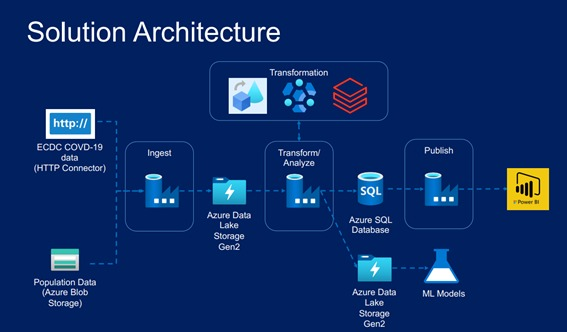

# Azure Data Factory for Data Engineers - Project Covid 19

  

## ❗ Sobre

### Objetivo
Demonstração de um case real utilizando o Azure Data Factory, responsável pela ingestão e orquestração do pipeline.

## 📄  que é abordado

Os principais aprendizados técnicos podem ser categorizados pela operacionalização das ferramentas Azure Data Factory (ADF), Azure Storage Solutions, Azure HDInsight & Datarbricks.

### ⚙️ Azure Data Factory

Principal ferramenta em cloud da Microsoft utilizada para tarefas de obtenção, ingestão e orquestração de dados. 

- Realização de integração de dados via HTTP, Blob Storage e Data Lake Gen2, Activies como Get Metadata, Ff, ForEach, Remoção, Validação, dentre outras. 
- Utilização de parâmetros e variáveis em pipelines, criação e configuração de datasets e LinkedServices para criação de Metadados. 
- Operações de debug, agendamentos por Event Trigger, Schedule Trigger e Tumbling Window Trigger. 
- Integração e orquestração com Databricks e HDInsight, Orquestração de todas as activites via pipeline. 
- Aplicação do Log Analytics Workspace para monitoramento das atividades

### 📂 Azure Storage Solutions

Ferramentas em cloud da Microsoft utilizadas para armazenamento de arquivos, controle de acessos e centralização de informações.

- Criação e provisionamento de Storage Account, Containers, Upload de dados, IAM e utilização do Azure Storage Explorer. 
- Criação de Data Lake Gen2, Conainers, Upload de dados, IAM. 
- Criação de Azure SQL Database, valores, usuário administrador, criação de tabelas, carga de dados e queries.

### ⚙️ Azure HDinsight & Databricks

Ferramentas utilizadas para processamentos de grandes volumes de dados, no qual apenas o Data Factory não seria capaz de realizar os devidos tratamentos.

- Criação de clusters em HDInsight, interação via UI, utilização de tabelas em Hive, requição das activities via data factory.
- Criação de Workspace no Azure Databricks, criação de Clusters, realizando operações de mount em Storage Account, criação de notebooks, transformações via pyspark, requisição dos notebooks via ADF.

## 📄 Estruturação

O projeto é aplicado desde a obtenção dos dados do Covid 19 até a sua entrega de maneira estruturada, sendo possível o consumo por analistas de bi, cientistas de dados e até mesmo outros engenheiros de dados. 

### 📦 Fontes de dados

As fontes dos dados são da **ECDC** contendo informações de casos confirmados, óbitos, hospitalizações e números de testes realizados e **European Statistical System** contendo informações gerais sobre a população.

### 💻 Arquitetura proposta

  

